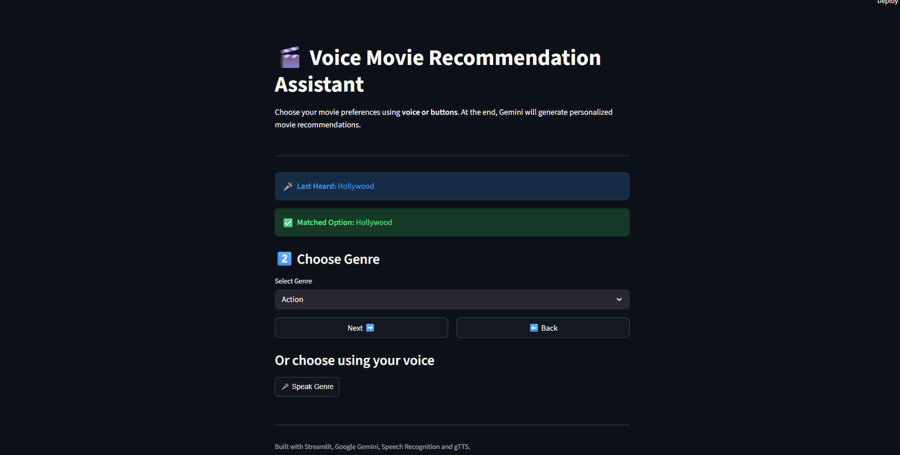
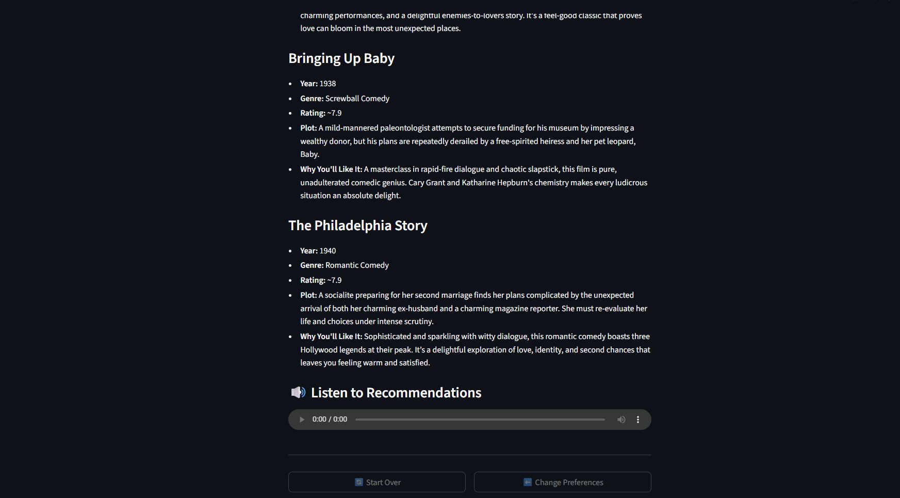

# 🎬 Voice Movie Recommendation Assistant

An AI-powered movie recommendation application that uses **Google Gemini**, **voice recognition**, and **text-to-speech** to provide personalized movie recommendations.

## 📸 Screenshots

### Home Screen


### Preference Selection


### Movie Recommendations


### Voice Output


## Features

* 🎤 Voice-based preference selection
* 🎬 Hollywood and Bollywood selection
* 🎭 Genre-based recommendations
* 😊 Mood-based recommendations
* 📅 Movie-era selection
* 🤖 AI-powered recommendations using Google Gemini
* 🔊 Text-to-speech movie recommendations
* 🖱️ Button and dropdown controls as alternatives to voice input
* 🔄 Start-over and preference modification options

## How It Works

The application collects four movie preferences:

1. Industry
2. Genre
3. Mood
4. Era

The selected preferences are sent to Google's Gemini model, which generates five movie recommendations based on the user's choices.

The application also supports voice interaction:

```text
User speaks
     ↓
Microphone input
     ↓
WEBM audio
     ↓
Audio conversion
     ↓
Speech Recognition
     ↓
Preference matching
     ↓
Gemini API
     ↓
Movie recommendations
     ↓
Text-to-Speech
     ↓
Audio response
```

## Technologies Used

* **Python**
* **Streamlit**
* **Google Gemini API**
* **Google Speech Recognition**
* **gTTS**
* **PyDub**
* **streamlit-mic-recorder**

## Project Structure

```text
movie-recommendation/
│
├── app.py
├── requirements.txt
├── README.md
├── .gitignore
│
└── .streamlit/
    └── secrets.toml
```

## Installation

Clone the repository:

```bash
git clone https://github.com/YOUR_USERNAME/movie-recommendation.git
cd movie-recommendation
```

Install the required dependencies:

```bash
pip install -r requirements.txt
```

## Gemini API Key

Create a `.streamlit` folder in the project directory.

Inside it, create:

```text
secrets.toml
```

Add:

```toml
GEMINI_API_KEY = "your_gemini_api_key"
```

The secrets file should **never be committed to GitHub**.

## Run the Application

Run:

```bash
streamlit run app.py
```

Then open the local Streamlit URL shown in the terminal, usually:

```text
http://localhost:8501
```

## Audio Requirement

The application uses PyDub to convert microphone recordings before speech recognition.

A working **FFmpeg** installation is required for audio conversion.

Check your installation with:

```bash
ffmpeg -version
```

## Important Security Note

API keys and other secrets are stored outside the source code using Streamlit secrets.

The following file should never be uploaded:

```text
.streamlit/secrets.toml
```

## Future Improvements

* Add movie posters and trailers
* Add real-time movie ratings using a movie database API
* Add multilingual voice recognition
* Add conversational follow-up questions
* Add user accounts and saved recommendations
* Improve voice matching using natural-language intent detection
* Add filtering by streaming platform
* Add recommendation history

## Author

**Bhoomi Wadhwani**

CSE (AI & ML)
